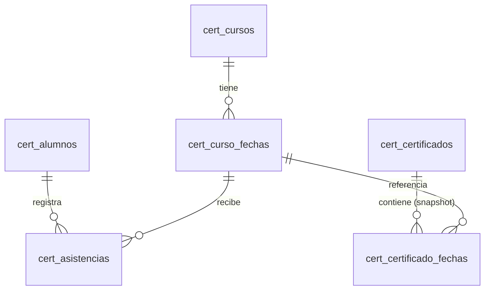

# Arquitectura y Diseño Relacional (M4-02)

Este diseño consolida las estructuras de la base de datos MariaDB 10.6 para gestionar cursos, alumnos y asistencias, base del sistema de certificados.

## Entidades y Columnas

### `cert_alumnos`
Almacena los datos de las personas, protegiendo su documento.
- `id` (BIGINT UNSIGNED, PK)
- `dni_hash` (BINARY(32), UNIQUE): HMAC-SHA-256 para búsquedas.
- `dni_cifrado` (VARBINARY(512)): Cifrado simétrico AES-256-GCM.
- `dni_mostrar` (VARCHAR(20), NULL): Máscara visual.
- `nombre` (VARCHAR(160))
- `created_at`, `updated_at` (DATETIME)

### `cert_cursos`
Representa los cursos habilitados en el instituto.
- `id` (BIGINT UNSIGNED, PK)
- `codigo` (VARCHAR(40), UNIQUE)
- `nombre` (VARCHAR(180))
- `estado` (ENUM('activo', 'inactivo', 'archivado'), IDX)
- `created_at`, `updated_at` (DATETIME)

### `cert_curso_fechas`
Fechas (clases/encuentros) específicas de cada curso.
- `id` (BIGINT UNSIGNED, PK)
- `curso_id` (BIGINT UNSIGNED, FK a `cert_cursos`)
- `fecha` (DATE)
- `descripcion` (VARCHAR(180))
- `orden` (SMALLINT UNSIGNED)
- `created_at` (DATETIME)
- **Unique Constraints:** `(curso_id, orden)` y `(curso_id, fecha)`

### `cert_asistencias`
Registro de asistencia de un alumno a una fecha particular de un curso.
- `id` (BIGINT UNSIGNED, PK)
- `alumno_id` (BIGINT UNSIGNED, FK a `cert_alumnos`)
- `curso_fecha_id` (BIGINT UNSIGNED, FK a `cert_curso_fechas`)
- `creado_en` (DATETIME)
- `eliminado_en` (DATETIME, NULL): Marca para soft delete.
- `asistencia_activa` (TINYINT STORED): Generado para garantizar unicidad.
- **Unique Constraint:** `(alumno_id, curso_fecha_id, asistencia_activa)`

### `cert_certificado_fechas`
Snapshot histórico de las fechas incluidas en un certificado.
- `id` (BIGINT UNSIGNED, PK)
- `certificado_id` (BIGINT UNSIGNED, FK a `cert_certificados`)
- `curso_fecha_id` (BIGINT UNSIGNED, FK a `cert_curso_fechas`)
- `fecha` (DATE)
- `descripcion` (VARCHAR(180))
- `orden` (SMALLINT UNSIGNED)
- `created_at` (DATETIME)
- **Unique Constraint:** `(certificado_id, orden)`

### `cert_configuracion_institucional`
Parámetros globales (nombres de autoridades).
- `id` (TINYINT UNSIGNED, PK): Restringido a valor `1` vía `CHECK`.
- `rector_nombre` (VARCHAR(160))
- `asesor_pedagogico_nombre` (VARCHAR(160))
- `texto_certificado` (TEXT)
- `updated_at` (DATETIME)

## Diagrama ER Simplificado

*(Nota: `cert_certificados` corresponde a migraciones base/previas)*

## Claves Foráneas

- `fk_cert_curso_fechas_curso`: `cert_curso_fechas(curso_id)` -> `cert_cursos(id)`
- `fk_cert_asistencias_alumno`: `cert_asistencias(alumno_id)` -> `cert_alumnos(id)`
- `fk_cert_asistencias_curso_fecha`: `cert_asistencias(curso_fecha_id)` -> `cert_curso_fechas(id)`
- `fk_cert_certificado_fechas_cert`: `cert_certificado_fechas(certificado_id)` -> `cert_certificados(id)`
- `fk_cert_certificado_fechas_cf`: `cert_certificado_fechas(curso_fecha_id)` -> `cert_curso_fechas(id)`

**Política:** `ON DELETE RESTRICT ON UPDATE CASCADE` para todas.
