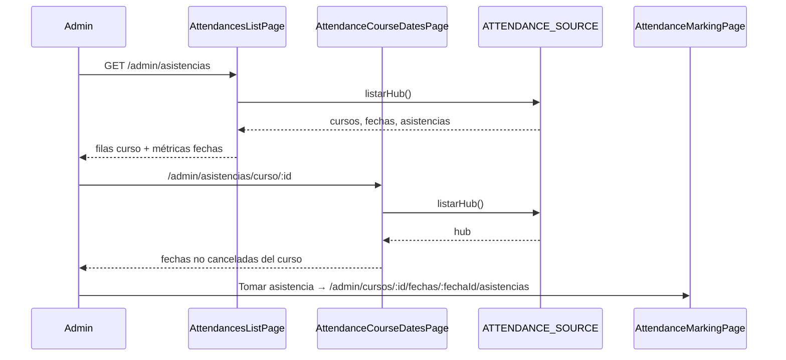

# Design: Frontend — listado de asistencias por curso

## Technical Approach

Reorganizar el hub FE de Opción A: `/admin/asistencias` lista **cursos**; `/admin/asistencias/curso/:id` elige **fecha**; el marcado existente no se toca. Un solo `ATTENDANCE_SOURCE.listarHub()` alimenta listado e intermedia (filtro client-side). Paridad visual con el admin actual (tabla/cards, chips, skeleton, empty/error). Alinea proposal + delta de `admin-attendances-frontend` (sdd-spec en paralelo).

## Architecture Decisions

| Decisión | Opciones | Tradeoff | Elección |
|----------|----------|----------|----------|
| Datos intermedia | Hub filtrado vs `COURSES_SOURCE.obtener` + asistencias | Hub = 1 GET, mismas fechas/conteos; obtener = 2+ round-trips / N+1 riesgo | **`listarHub()` + filtrar `fechas`/`asistencias` por `cursoId`** |
| Filas listado | Flatten fechas vs 1 fila/curso | Flatten = UX actual rota | **`FilaCurso` desde `hub.cursos`** (incl. 0 fechas asistibles) |
| Filtros listado | Chips estado fecha / estado curso / solo texto | Chips fecha no aplican a filas-curso | **Solo búsqueda nombre/código**; chips de fecha → intermedia |
| Métricas listado | `presentes/alumnosActivos` vs conteos de fechas | `alumnosActivos` miente por fila | **N fechas asistibles** (+ **N con ≥1 presente** vía `hub.asistencias`) |
| CTA intermedia | Cargar/Ver dual vs un CTA | Dual = complejidad del detalle | **Un CTA «Tomar asistencia»** → marcado |
| Empty sin fechas | Ocultar curso vs empty + link | Ocultar oculta trabajo pendiente | **Visible en listado**; empty intermedia + link `/admin/cursos/:id` |
| Rutas | Solo `asistencias` vs + `asistencias/curso/:id` | Exact match no captura hijos | **Declarar `asistencias/curso/:id` antes de `asistencias`** |

## Data Flow



Estados UI (ambas pantallas): `cargando` + skeleton → `error` + reintentar → contenido; listado: `vacioTotal` / `vacioFiltro`; intermedia: curso ausente en hub, empty fechas, chips programada|realizada.

## File Changes

| File | Action | Description |
|------|--------|-------------|
| `attendances/pages/list/attendances-list-page.{ts,html,css}` | Modify | Filas = cursos; quitar chips fecha; CTA → intermedia; métricas honestas; copy intro |
| `attendances/pages/list/attendances-list-page.spec.ts` | Modify | Expectativas filas-curso (no 11 fechas); búsqueda; sin chips fecha; link intermedia |
| `attendances/pages/course-dates/attendance-course-dates-page.{ts,html,css}` | Create | Fechas asistibles; chips estado; CTA marcado; empty→detalle curso |
| `attendances/pages/course-dates/attendance-course-dates-page.spec.ts` | Create | Filtro, empty, CTA, curso no encontrado |
| `app.routes.ts` | Modify | `asistencias/curso/:id` lazy load **antes** de `asistencias` |
| `app.routes.spec.ts` | Modify | Smoke intermedia + orden |
| `openspec/changes/.../specs/admin-attendances-frontend/spec.md` | (spec) | Delta MODIFIED/ADDED — no en apply de código |

Sin cambios: HTTP/mock hub, marcado, certificados, detalle de curso (salvo destino del link empty).

## Interfaces / Contracts

Sin cambios de API. Modelos locales de página:

```typescript
interface FilaCurso {
  readonly id: number;
  readonly codigo: string;
  readonly nombre: string;
  readonly estado: string;
  readonly fechasAsistibles: number; // hub.fechas !cancelada
  readonly fechasConPresentes: number; // fechas con ≥1 asistencia en hub
}

interface FilaFechaCurso {
  readonly fecha: /* HubFecha */;
  readonly presentes: number; // solo conteo presentes; sin /alumnosActivos
}
```

Links: listado → `['/admin/asistencias/curso', id]`; intermedia → `['/admin/cursos', cursoId, 'fechas', fechaId, 'asistencias']`.

## Testing Strategy

| Layer | What | Approach |
|-------|------|----------|
| Unit/comp | Listado + intermedia | Jasmine/Karma existente: filas=cursos seed, búsqueda, empty 0 fechas, chips en intermedia, CTA href marcado |
| Routes | Orden + loadComponent | Extender `app.routes.spec.ts` |
| E2E | — | Fuera de alcance |

## Migration / Rollout

No migration. Rollback = revert commits FE.

## Open Questions

- [x] CTA label: **«Tomar asistencia»** (ya en listado actual; un solo verbo).
- [ ] ¿Mostrar chip de **estado de curso** en fila del listado? Opcional visual; no bloquea tasks (default: sí si el patrón de otras tablas admin lo usa; sin filtro por estado curso).
