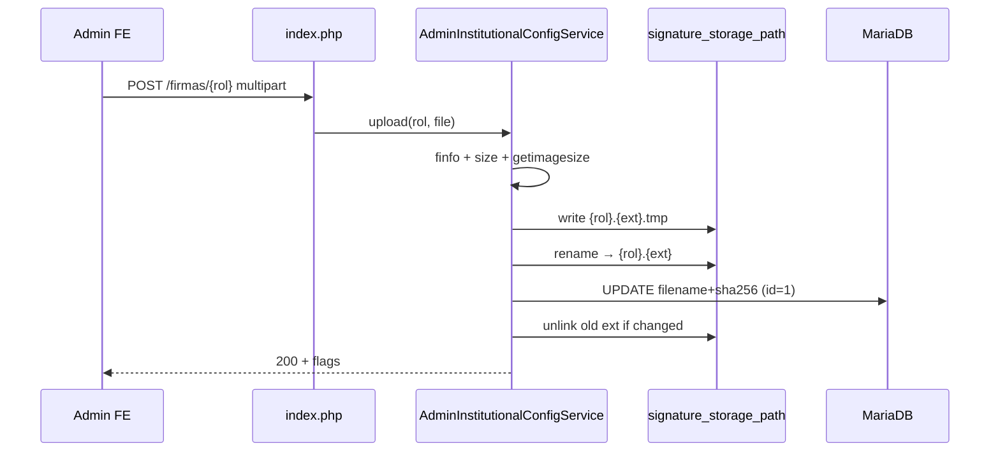
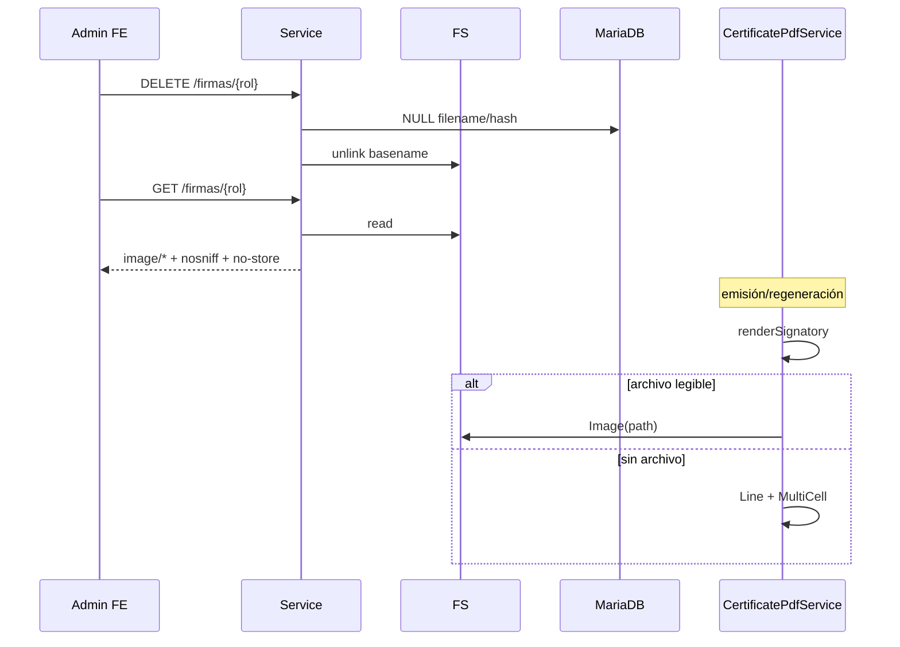

# Design: Firmas de autoridades (configuración institucional)

## Technical Approach

Extender `cert_configuracion_institucional` y el admin GET/PUT textos con **Opción A**: endpoints multipart por rol, independientes de Guardar. Storage `signature_storage_path` (espejo de `certificate_storage_path`). PDF: imagen en `renderSignatory` si hay archivo; si no, tipografía. Apply: **DB → BE (API+PDF) → FE (TDD)**. Capability `admin-institutional-signatures` + deltas HTTP/consulta/PDF/deploy.

## Architecture Decisions

| Decisión | Alternativas | Elección | Rationale |
|----------|--------------|----------|-----------|
| Persistencia | A inmediata / B con Guardar | **A** | Sin multipart en PUT textos |
| Rutas | Nested vs query | `…/firmas/{rector\|asesor}` | Whitelist de rol; un handler |
| Storage | Webroot / fuera | **fuera webroot** | Igual que PDFs; sin URL pública |
| Metadatos DB | Solo flags / file+hash | **filename + sha256** | Flags derivados; integridad |
| Replace | Overwrite / atómico | **tmp→rename→DB→unlink ext vieja** | Falla = firma anterior intacta |
| Validación | Header cliente / sniff | **finfo + getimagesize** | PNG/JPEG; **1 MB**; ~**1200×400** |
| Preview | URL pública / GET auth | **GET admin** + nosniff + no-store | Sesión vigente |
| PDF | Solo texto / Image | **Image si existe** | Fallback tipográfico |
| Auth | Nueva / vigente | **Sesión admin actual** | Out of scope auth nueva |

## Data Flow

```
UI ─POST multipart─► index.php ─► AdminInstitutionalConfigService
                                      │ finfo/size/dims → tmp → rename
                                      ▼
                            signature_storage_path/{rol}.{ext}
                                      ▼
                   cert_configuracion_institucional (filename+hash)

GET textos → rectorSignaturePresent / advisorSignaturePresent
GET firmas/{rol} → bytes + MIME real (preview)
DELETE → unlink + NULL DB
Emisión → resolve abs path → renderSignatory(Image|texto)
```

## Sequence diagrams

### Upload / replace



### Delete / preview / PDF



## File Changes

| File | Action | Description |
|------|--------|-------------|
| `database/migrations/014_firmas_autoridades.sql` | Create | `rector_firma_*` / `asesor_firma_*` (filename, sha256) |
| `database/docs/014-firmas-autoridades.md` | Create | Doc + rollback |
| `apps/backend-php/config/certificados-config.example.php` | Modify | `signature_storage_path` |
| `apps/backend-php/src/Config.php` | Modify | Requerir/normalizar path firmas |
| `.../AdminInstitutionalConfigService.php` | Modify | upload/delete/preview; flags en DTO |
| `.../InstitutionalConfig.php` | Modify | Paths opcionales para PDF |
| `.../CertificatePdfService.php` | Modify | Image + fallback tipográfico |
| `apps/backend-php/index.php` | Modify | Rutas POST\|DELETE\|GET firmas |
| `apps/backend-php/tests/*Signature*` | Create | Scripts validación/replace |
| `.../institutional-config.service.ts` (+ http/in-memory) | Modify | Flags + métodos firmas |
| `.../institutional-config-page.{ts,html,css}` + specs | Modify | Input file real; TDD; sin dirty por firma |
| `docs/deploy/00-cpanel-*.md`, `docs/backend/01-contrato-*.md` | Modify | Path + contrato API |

## Interfaces / Contracts

```http
POST|DELETE|GET /admin/configuracion-institucional/firmas/{rector|asesor}
GET  /admin/configuracion-institucional  → + rectorSignaturePresent, advisorSignaturePresent
PUT  /admin/configuracion-institucional  → JSON textos (sin multipart)
```

Basename `{rol}.png|.jpg`; DB solo basename + sha256. Errores: `VALIDATION_ERROR`, `NOT_FOUND`, `CONFIGURATION_ERROR`.

## Testing Strategy

| Layer | What | Approach |
|-------|------|----------|
| BE scripts | MIME, replace, flags | `apps/backend-php/tests/` |
| FE unit | upload/delete/preview/flags | Jasmine; **TDD** |
| Manual | PDF con/sin firma | Staging post-014 |

## Migration / Rollout

1. Dir fuera webroot + `signature_storage_path` en config externa.
2. Migración `014` (columnas nullable).
3. Deploy BE → build FE.
4. Rollback: revertir código; DROP columnas controlado; vaciar dir. PDFs previos intactos.

## Open Questions

- [x] 1 MB / ~1200×400; flags GET; replace atómico; preview headers (locked).
- [ ] ¿TCPDF `Image` exige GD? Verificar en apply (QR ya usa GD).
