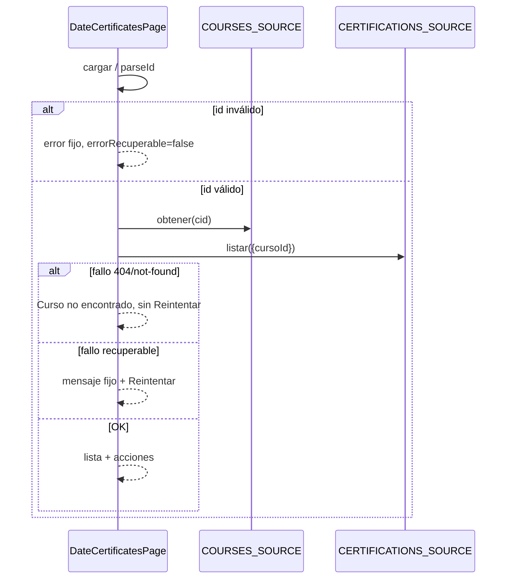

# Design: Auditoría P15 — certificados por fecha

## Technical Approach

Auditoría quirúrgica de `DateCertificatesPage` (enfoque 1): honesty P13/P14 (`errorRecuperable` + Reintentar solo en catch de carga; `mensajeErrorApi` en acciones) y link «Expediente» por fila a `/admin/certificaciones/:id`. Conservar listado `cursoId`, entrega inline Copiar+QR, PDF, empty/CTA, DNI completo y anti-token. Sin HTTP/backend ni P14/P16. Delta `admin-attendances-frontend` ya en el change.

## Architecture Decisions

| Opción | Tradeoff | Decisión |
|--------|----------|----------|
| Solo página+tests+delta vs filtrar `fechaId` / deep-links P16 | Filtro rompe contrato; deep-links rompen UX post-marcado | Página+tests+delta |
| Reintentar en todo error vs solo catch recuperable | Reintentar en not-found engaña | Flag solo catch no-404; id inválido sin flag |
| Raw `Error.message` vs `mensajeErrorApi` | Raw puede filtrar PII/ruido HTTP | Helper local (paridad marcado) |
| Expediente en `.cert-acciones` (button) vs link en `cert-datos` | Botón altera orden testeado | `<a>` en `cert-datos` (meta); acciones siguen Copiar→QR→PDF |
| Entrega `/entrega` vs inline | Nueva ruta fuera de alcance | Copiar + QR status quo |
| Panel fecha huérfana | Honesty menor; sin contrato | Diferido |

### Decision: `errorRecuperable` en `cargar`

**Choice**: Al iniciar carga → `errorRecuperable.set(false)`. `cid === null` → «Curso no encontrado.» + flag false. Catch: 404 o `/no encontrad/i` → mismo mensaje + false; resto → «No se pudieron cargar los certificados. Reintentá.» + true. `onReintentar()` solo si flag; re-llama `cargar(this.id())`.

**Rationale**: Paridad `AttendanceMarkingPage` / `AttendanceCourseDatesPage`.

### Decision: Acciones sin Reintentar

**Choice**: En catch de `copiarLink` / `descargarQr` / `descargarPdf`: `error.set(mensajeErrorApi(e))` (fallback genérico del helper); `errorRecuperable` permanece false. Sin botón Reintentar por fallo de acción.

**Rationale**: Locked default; error puede coexistir con la lista.

### Decision: Expediente fuera del orden de botones

**Choice**: Bajo `cert-meta` por fila:

```html
<a class="link-expediente" data-testid="cert-expediente"
   [routerLink]="['/admin/certificaciones', c.id]">Expediente</a>
```

También si revocado (`puedeEntregar` solo afecta Copiar/QR/PDF). CSS mínimo.

**Rationale**: Expediente adicional; el test de orden solo mira `button` en `.cert-acciones`.

## Data Flow

```
route :id,:fechaId ──effect──► cargar(id)
                    │ cid null → error fijo, no Reintentar
                    │ Promise.all(obtener, listar{cursoId})
                    │ OK → detalle + certificados
                    └ catch → not-found? fijo : recuperable+Reintentar

fila ──► Expediente (routerLink)
     ──► Copiar / QR / PDF → catch → mensajeErrorApi (sin Reintentar)
```



## File Changes

| File | Action | Description |
|------|--------|-------------|
| `.../date-certificates/date-certificates-page.ts` | Modify | `errorRecuperable`, `onReintentar`, `mensajeErrorApi` (+ `HttpErrorResponse`); honesty en `cargar` y catches de acciones |
| `.../date-certificates/date-certificates-page.html` | Modify | Panel error con Reintentar condicional; link Expediente en `cert-datos` |
| `.../date-certificates/date-certificates-page.css` | Modify | `.error-actions`, `.link-expediente` mínimos |
| `.../date-certificates/date-certificates-page.spec.ts` | Modify | Vacío, Reintentar vs not-found, expediente, no raw message; conservar anti-token/DNI y orden botones |
| `openspec/changes/audit-p15-asist-certs/specs/admin-attendances-frontend/spec.md` | Confirm | Delta ya refleja honesty + Expediente; no ampliar en apply |

## Interfaces / Contracts

Sin contratos HTTP nuevos. Helper privado local (no shared service):

```typescript
readonly errorRecuperable = signal(false);
onReintentar(): void { if (!this.errorRecuperable()) return; void this.cargar(this.id()); }
private mensajeErrorApi(err: unknown): string { /* paridad marking: envelope.message o fallback */ }
```

## Testing Strategy

| Layer | What to Test | Approach |
|-------|--------------|----------|
| Unit (spec existente) | Empty + CTA «Ir a marcar asistencias» | `listar` → `[]` o curso sin certs |
| Unit | Recuperable: Reintentar re-llama fuentes; sin PII/raw | Spy reject no-404; click Reintentar |
| Unit | Id inválido / 404: mensaje fijo, sin Reintentar | `id='x'` o reject not-found |
| Unit | Expediente `href` `/admin/certificaciones/:id`; label «Expediente» | `data-testid="cert-expediente"` |
| Unit | Acción fallida: `mensajeErrorApi`/genérico; sin Reintentar; sin raw único | Spy `obtenerEntregaManual` reject |
| Unit | Regresión | Orden Copiar→QR→PDF (botones); anti-token; DNI `/\d{7,8}/` |

## Threat Matrix

N/A — sin cambio de routing config, shell, subprocess, VCS/PR ni process-integration. Solo honesty UI + `routerLink` a ruta existente. PII: sin DNI/token en mensajes/logs; DNI completo solo en UI.

## Migration / Rollout

No migration required. Rollback = revertir `date-certificates-page.*` (+ delta si se mergeó).

## DO NOT TOUCH

- P14 `attendance-marking-page.*`
- P16 `certifications-list-page.*` / rediseño listado
- `http-certifications` / backend / SMTP / rotación token-QR
- Filtro por `fechaId`; ruta `/entrega`; aviso fecha huérfana
- Copy empty/intro (salvo typo); `app.routes*`; otras páginas de asistencias
- Archivo/working-tree de P14

## Open Questions

Ninguna bloqueante (defaults locked).
