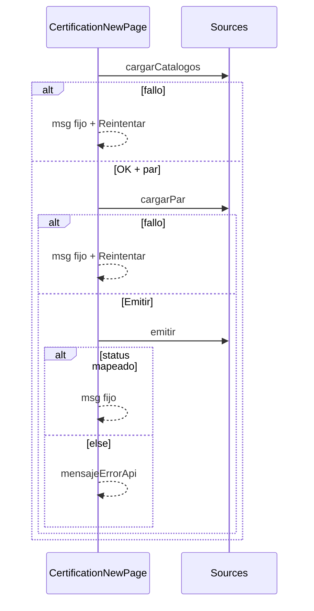

# Design: Auditoría P17 — Nueva certificación

## Technical Approach

Auditoría quirúrgica de `CertificationNewPage` (enfoque 1 locked): honesty P15-like (`errorRecuperable` + Reintentar solo en catch de loads catálogo/par; `mensajeErrorApi` P15-strict en emit else) + copy mínimo de rol vs Asistencias (sin «complementario»). Conservar ruta/CTAs, gates, body de emisión y navegación al expediente. Sin HTTP/backend; sin P14/P15/P16 archive/P18–P21. Delta MODIFIED `admin-certifications-frontend` / «Emisión directa…».

## Architecture Decisions

| Opción | Tradeoff | Decisión |
|--------|----------|----------|
| Página+tests+delta vs deprecar Nueva / link Asistencias | Deprecar rompe edge; link mezcla P14 | Página+tests+delta; solo copy |
| Un flag vs flags por superficie | Un flag confunde paneles | `errorCatalogosRecuperable` + `errorParRecuperable` |
| Reintentar en emit vs solo loads | Reintentar POST ≠ load | Solo loads |
| `mensajeErrorApi` P14 (`Error.message`) vs P15-strict | Raw filtra PII/ruido | Envelope o genérico es-AR |
| «complementario» solo subtítulo vs más copy | Residual confunde | Subtítulo + cta-note + hint PDF |
| Shared helper vs local | Shared fuera de alcance | Helper privado (paridad P15) |

### Decision: Honesty en loads

**Choice**: Al iniciar load → flag `false` + limpiar error. Catch `cargarCatalogos` → «No se pudieron cargar los catálogos. Reintentá.» + `errorCatalogosRecuperable=true`. Catch `cargarPar` (respeta `loadGen`) → «No se pudo evaluar la elegibilidad. Reintentá.» + `errorParRecuperable=true`. Reintentar gated; catálogos → `cargarCatalogos()`; par → `cargarPar()`. Sin raw `(e as Error).message`.

**Rationale**: Paridad P15; paneles independientes; locked.

### Decision: Emit else sin Reintentar

**Choice**: Conservar map 409/400/500. Else → `mensajeErrorApi(e)` P15-strict (`HttpErrorResponse` envelope `error.message`; si no, «No se pudo emitir la certificación.»). Nunca `Error.message`. Flags recuperables no se setean en emit.

**Rationale**: Acciones ≠ loads.

### Decision: Copy de rol edge

**Choice**: Subtítulo ≈ *«Emisión puntual de un certificado para un alumno y un curso. El flujo habitual es marcar asistencias en una fecha y generar desde ahí.»* Quitar «complementario» de subtítulo, `cta-note` y preview-hint. Sin link a Asistencias. Sin rediseño.

**Rationale**: Explore Q2–Q4; guía «alternativa».

## Data Flow

```
ngOnInit ──► cargarCatalogos
               │ OK → query preselect → [? cargarPar]
               └ catch → msg fijo + flag + Reintentar

elegirAlumno/onCurso ──► cargarPar (loadGen)
               │ OK → elegibilidad + preview
               └ catch → msg fijo + flag + Reintentar

Emitir ──► certs.emitir(4 campos)
               │ 201 → /admin/certificaciones/:id
               └ 409|400|500 fijo | else mensajeErrorApi (sin Reintentar)
```



## File Changes

| File | Action | Description |
|------|--------|-------------|
| `.../new/certification-new-page.ts` | Modify | Flags; msgs fijos loads; `mensajeErrorApi`+`HttpErrorResponse`; emit else; handlers Reintentar |
| `.../new/certification-new-page.html` | Modify | Copy sin «complementario»; Reintentar en `errorPar`; gate catálogos por flag |
| `.../new/certification-new-page.css` | Modify | Solo si reusa `.btn-retry` en aside par |
| `.../new/certification-new-page.spec.ts` | Modify | Honesty + copy; no debilitar anti-folio/409/query |
| `openspec/changes/audit-p17-certs-nueva/specs/admin-certifications-frontend/spec.md` | Create | Delta «Emisión directa…» (honesty + rol edge) |

## Interfaces / Contracts

Sin HTTP nuevos. Local: flags `errorCatalogosRecuperable` / `errorParRecuperable`; `mensajeErrorApi` P15-strict. Body emisión intacto: `{ alumnoId, cursoId, issuedAt, expiresAt: null }`.

## Testing Strategy

| Layer | What to Test | Approach |
|-------|--------------|----------|
| Unit | Catálogos: fijo + Reintentar; sin raw | Spy reject; click |
| Unit | Par: fijo + Reintentar → `cargarPar` | Spy reject |
| Unit | Emit else: genérico/envelope; sin Reintentar/raw | Reject no mapeado |
| Unit | Copy rol; sin «complementario» | Assert texto |
| Unit | Regresión | Anti-folio; 409/400; query; gates |

## Threat Matrix

N/A — sin routing/shell/subprocess/VCS/process-integration. PII: sin DNI/token en mensajes; DNI completo solo UI.

## Migration / Rollout

No migration. Rollback = revertir `certification-new-page.*` + delta. **No commit/push** (locked).

## DO NOT TOUCH

P16 archive uncommitted; P14/P15/P18–P21; HTTP/backend/token-QR; eliminar ruta/CTAs; link a Asistencias.

## Open Questions

Ninguna bloqueante (defaults 1–9 locked).
