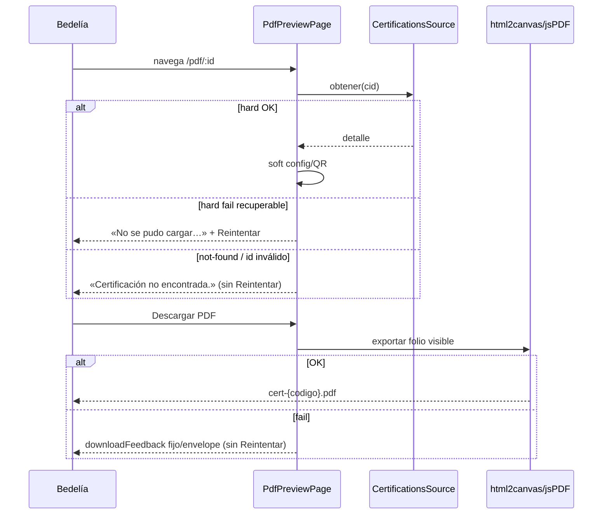

# Design: Auditoría P19 — Folio PDF

## Technical Approach

Cirugía en `certification-pdf-preview-page.*` (+ delta MODIFIED «Paridad visual, folio imprimible…»). Cerrar honesty (sin raw `Error.message` en `load`/`descargarPdf`), alinear Descargar=html2canvas+jsPDF (no seam API P-13), y `errorRecuperable` load-only con Reintentar (paridad P18). Conservar print A4, firmas 3:2 CSS, QR canónico, pipeline export. Sin HTTP/backend, sin tocar archive P18, sin commit.

## Architecture Decisions

| Decision | Options | Tradeoff | Choice |
|----------|---------|----------|--------|
| Reintentar gate | Solo texto · sin flag · `errorRecuperable` | Explore default 5 = no flag; propose/user override | **`errorRecuperable` load-only** — true solo fallo hard recuperable de `obtener`; false en id inválido / not-found / éxito. Soft QR/config y fallo descarga **nunca** lo setean. |
| Load hard copy | Raw · fijo es-AR | Raw viola honesty | **Fijo**: *«No se pudo cargar la certificación.»* + recuperable; *«Certificación no encontrada.»* + no recuperable (id null / 404 / mensaje not-found). Mirror `aplicarErrorCarga` P18. |
| Download errors | Raw · fijo only · **P15-strict** | html2canvas no es HTTP; laxo filtra `Error.message` | **P15-strict** local con fallback *«No se pudo generar el PDF.»* (solo envelope `HttpErrorResponse`; else fijo). Sin Reintentar; sin seam `CertificationsService.descargarPdf`. |
| Filename | Solo id pad · **`detalle.numero`** | Drift vs delivery | Preferir `detalle.numero.trim()` si hay; else `IFTS14-CERT-{id padded}` (paridad delivery). |
| Spec Descargar | Seam API P-13 · captura folio | Spec fuerza HTTP / rompe `REQ-PAR-PDF-001` | **Descargar = html2canvas+jsPDF del folio**; Imprimir = `window.print()` A4. Reemplazar escenario P-13. |
| CSS / export | Reabrir · tocar-si-roto | Rewrite sin evidencia | **Conservar** print 1 pág, firmas 3:2, `scale:2`; CSS solo si verify demuestra overflow/ratio roto. |
| Soft / archive | Touch P18 archive · rewrite preview | Fuera de alcance | **No tocar** archive P18 uncommitted, preview, P20/P21, backend. |

## Data Flow

```
effect(id) → load()
  reset error + errorRecuperable=false
  cid null → «Certificación no encontrada.» + recuperable=false  (sin Reintentar)
  Promise.all[ obtener(hard), config.obtener().catch(null) ]
    catch / hard reject:
      not-found → fijo + recuperable=false
      else      → «No se pudo cargar…» + recuperable=true
    soft: aplicarConfig + cargarValidacion + maybeAutoDownload (intactos)
HTML error(): mensaje + @if (errorRecuperable()) Reintentar → load()
descargarPdf catch → mensajeErrorApi(e, «No se pudo generar el PDF.»)  // no flag
exportarFolioVisibleComoPdf → html2canvas+jsPDF → pdf.save(pdfFilename())
```



## File Changes

| File | Action | Description |
|------|--------|-------------|
| `.../pdf/certification-pdf-preview-page.ts` | Modify | `errorRecuperable`; `aplicarErrorCarga`; `onReintentar`→`load`; `mensajeErrorApi` P15-strict en descarga; `numeroExpediente` ← `detalle.numero`; import `HttpErrorResponse` |
| `.../pdf/certification-pdf-preview-page.html` | Modify | Botón Reintentar si `errorRecuperable()` (mirror preview) |
| `.../pdf/certification-pdf-preview-page.css` | Touch-only-if | Overflow 2.ª pág / firmas ≠ 3:2 solo con evidencia verify |
| `.../pdf/certification-pdf-preview-page.spec.ts` | Modify | Anti-raw load/descarga; Reintentar solo recuperable; not-found sin botón; conservar `REQ-PAR-PDF-001`; filename si fixture trae `numero` |
| `openspec/changes/audit-p19-certs-pdf/specs/admin-certifications-frontend/spec.md` | Create | Delta MODIFIED «Paridad visual…» (sdd-spec) |
| P18 archive / preview / delivery / HTTP / backend | — | **Out of scope** |

## Interfaces / Contracts

```typescript
readonly errorRecuperable = signal(false); // load-only

private mensajeErrorApi(err: unknown, fallback: string): string {
  if (err instanceof HttpErrorResponse) {
    const msg = (err.error as { error?: { message?: string } } | null)?.error?.message;
    if (typeof msg === 'string' && msg.trim()) return msg.trim();
  }
  return fallback; // nunca (e as Error).message
}
```

`CertificationsService.descargarPdf` permanece en el servicio para otros flujos; **esta página no lo invoca**.

## Testing Strategy

| Layer | What | Approach |
|-------|------|----------|
| Unit | Honesty load/descarga | Reject/`Error('leak…')` → UI sin substring raw; fijos/genéricos |
| Unit | Reintentar | Invalid id / not-found: sin botón; hard recuperable: llama `load` |
| Unit | Export | Conservar `REQ-PAR-PDF-001` (html2canvas, no seam API); filename semántico |
| Verify | Visual/perf | Print 1 pág A4; firmas 3:2; html2canvas aceptable — no bajar `scale` a ciegas |

## Threat Matrix

N/A — no routing, shell, subprocess, VCS/PR automation, executable-file classification, or process-integration boundary.

## Migration / Rollout

No migration required. Solo UI admin folio + tests + delta. Sin feature flag. **No commit** en este ciclo salvo pedido explícito.

## Open Questions

- None — locks user/propose: honesty + `errorRecuperable` load-only; filename `detalle.numero`; P15-strict o fijo descarga; keep html2canvas/print/firmas; leave P18 archive; no HTTP; no commit.
