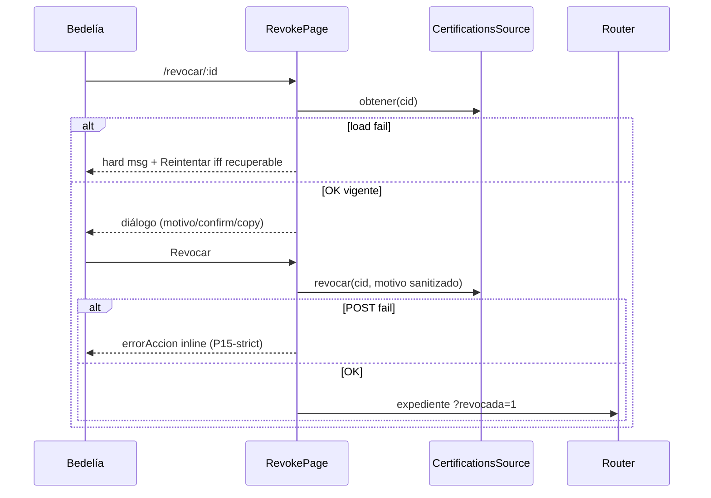

# Design: Auditoría P21 — Revocar certificación

## Technical Approach

Cirugía front-only en `certification-revoke-page.{ts,html,css,spec.ts}` + delta `admin-certifications-frontend`. Mirror P18/P20 honesty: `aplicarErrorCarga` + `errorRecuperable` load-only; submit vía `mensajeErrorApi` P15-strict en signal `errorAccion` **inline** (no reusar overlay de carga). `MOTIVO_MAX` → 180. Conservar confirmación, copy consecuencias, sanitize motivo, Escape, focus trap. Flash `?revocada=1` **deferred**. Sin P20 rewrite, P22, backend.

## Architecture Decisions

| Decision | Options | Tradeoff | Choice |
|----------|---------|----------|--------|
| Load honesty | Raw `Error.message` · **fijo + flag** | Paridad P18/P20 | `aplicarErrorCarga`: not-found *«Certificación no encontrada.»* + `errorRecuperable=false`; else *«No se pudo cargar la certificación.»* + `true` |
| Reintentar | Siempre · nunca · **gated** | Locked | Solo `@if (errorRecuperable())` en panel hard; submit **nunca** setea el flag |
| Submit error channel | Reusar `error` overlay · **`errorAccion` inline** | Hoy overlay tapa diálogo si `detalle` vivo | Signal `errorAccion` + alert inline en body del diálogo; overlay `error()` solo carga |
| Submit message | Raw · laxo · **P15-strict** | Envelope o fallback | Local `mensajeErrorApi(err, 'No se pudo revocar la certificación.')` — solo `HttpErrorResponse.error.error.message`; else fallback |
| MOTIVO_MAX | 400 · **180** | Backend trunca 180 | Constante + `maxlength` + `onMotivoChange` slice → **180** |
| Confirm/copy/sanitize | Reescribir · **keep** | Ya OK | Sin cambios de copy/checkbox/regex sanitize |
| Post-nav flash | Wire preview · **defer** | Blast P18 | Conservar `?revocada=1`; expediente re-fetch basta |
| Spec target | `admin-certificate-revocation` · **`admin-certifications-frontend`** | Front-only | ADDED UI revoke honesty; API spec **out** |
| Scope | +backend · +P20/P22 · front-only | Hard locks | Front-only; no commit |

## Data Flow

```
effect(id) → cargar()
  reset: detalle/error/errorAccion/errorRecuperable/motivo/confirm/intentado
  cid null → «Certificación no encontrada.» + recuperable=false
  obtener(cid)
    OK → detalle.set; recuperable=false
    catch → aplicarErrorCarga(reason)   // hard overlay; sin raw

HTML error(): msg + @if (errorRecuperable) Reintentar → cargar()
HTML detalle: diálogo (confirm/motivo/copy) + @if (errorAccion) inline

onRevocar()
  gates: esRevocable + motivoValido + confirmado
  errorAccion=''; sanitize motivo → certs.revocar → navigate ?revocada=1
  catch → errorAccion = mensajeErrorApi(...); diálogo permanece
```



## File Changes

| File | Action | Description |
|------|--------|-------------|
| `.../revoke/certification-revoke-page.ts` | Modify | `errorRecuperable`, `errorAccion`, `aplicarErrorCarga`, `onReintentar`, `mensajeErrorApi`, MOTIVO_MAX=180; import `HttpErrorResponse`; submit catch → `errorAccion` |
| `.../revoke/certification-revoke-page.html` | Modify | Reintentar gated en overlay carga; alert inline `errorAccion` en diálogo (no overlay) |
| `.../revoke/certification-revoke-page.css` | Touch-if-needed | Estilos mínimos Reintentar / inline alert si faltan clases (`msg-error` reutilizable) |
| `.../revoke/certification-revoke-page.spec.ts` | Modify | Anti-raw load/submit; Reintentar load-only; not-found sin Reintentar; submit inline + diálogo vivo; maxlength 180 |
| `openspec/changes/.../specs/admin-certifications-frontend/spec.md` | Create (sdd-spec) | ADDED revoke-dialog honesty + gates |
| Preview flash / P20 archive / delivery / P22 / PHP | — | **Out of scope** |

## Interfaces / Contracts

```typescript
readonly error = signal('');              // load overlay only
readonly errorRecuperable = signal(false); // load-only
readonly errorAccion = signal('');         // submit inline

private mensajeErrorApi(err: unknown, fallback: string): string {
  if (err instanceof HttpErrorResponse) {
    const msg = (err.error as { error?: { message?: string } } | null)?.error?.message;
    if (typeof msg === 'string' && msg.trim()) return msg.trim();
  }
  return fallback;
}
// MOTIVO_MAX = 180; MOTIVO_MIN = 12 (unchanged)
```

## Testing Strategy

| Layer | What | Approach |
|-------|------|----------|
| Unit (Karma/Jasmine) | Load hard fijo + Reintentar; not-found/id inválido sin Reintentar; anti-raw load/submit; submit fail → `errorAccion` inline + diálogo visible + `error` vacío; MOTIVO_MAX 180; keep confirm/Escape/deep-link | Extend `certification-revoke-page.spec.ts`; spy `obtener`/`revocar` |
| Integration / E2E / HTTP | — | Out of scope |

## Threat Matrix

N/A — no routing config, shell, subprocess, VCS/PR automation, executable-file classification, or process-integration boundary. Escape/`Router.navigate` handoff unchanged.

## Migration / Rollout

No migration required. Front-only; revert page + frontend spec delta.

## Open Questions

- None — explore/propose LOCK accepted (flash deferred; MOTIVO_MAX 180; HTTP only if PII audit leak proven).
