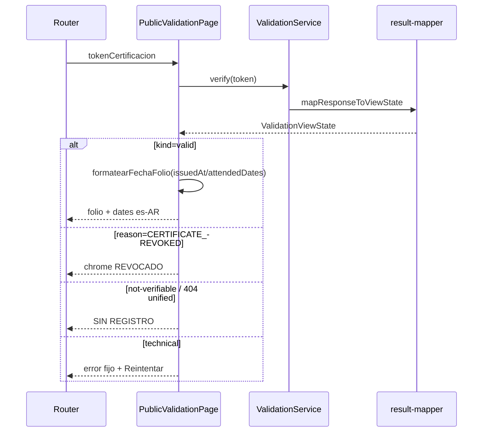

# Design: Auditoría P22 — Validación pública

## Technical Approach

Lean front-only close of P22 on `/validar/:token`. Keep `ValidationService` → `result-mapper` honesty unchanged. Add display-only es-AR date formatting on `PublicValidationPage` for folio `issuedAt` / `attendedDates`. Document staging revoked→`404 CERTIFICATE_NOT_FOUND` as accepted backend contract (not a front bug). Delta `frontend-public-validation` + PLAN checkboxes. No PHP, no P21, no `RATE_LIMITED` slice, no commit.

## Architecture Decisions

| Decision | Options | Tradeoff | Choice |
|----------|---------|----------|--------|
| Date format locus | Mapper mutates DTO · shared util · **page helper** | Mapper keeps ISO contract; page already formats `consulta` | `formatearFechaFolio(iso)` on `PublicValidationPage` (mirror delivery `formatearFecha`); bind in HTML |
| Format algorithm | Manual pad · **Intl es-AR 2-digit** | Parity delivery + muestra `dd/mm/yyyy` | `Intl.DateTimeFormat('es-AR', {day:'2-digit', month:'2-digit', year:'numeric'})` on local Y-M-D parse; invalid → passthrough raw |
| `verifiedAt` / consulta | Format API verifiedAt · **leave** | Client `consultaTimestamp` already es-AR | Only `issuedAt` + `attendedDates` rows |
| Revoked staging | Unlock PHP · **document unified** | Hard lock front-only | Spec/PLAN note: staging collapse ≡ no-encontrada; REVOCADO chrome only when `CERTIFICATE_REVOKED` arrives (mock) |
| Honesty | Retrofit admin pattern · **preserve** | Already safe | No raw `Error.message`; fixed technical copy; keep Reintentar on técnico + no-encontrada |
| `RATE_LIMITED` | Map copy · **defer** | Shared mapper blast | Untouched `result-mapper` |
| Spec target | Backend verify · **`frontend-public-validation`** | Front-only | ADDED/MODIFIED: unified staging + date display |
| Scope | +PHP revoke chrome · front polish | Locks | Page + spec + PLAN; no P21/D0 rotate |

## Data Flow

```
route :tokenCertificacion
  → resource → ValidationService.verify
    → ValidationSource.fetch → mapResponseToViewState
      → ValidationViewState (ISO strings in DTO)

UI válida:
  issuedAt     → formatearFechaFolio(issuedAt)     → dd/mm/yyyy
  attendedDates[] → formatearFechaFolio(fecha)     → dd/mm/yyyy
  consulta     → formatConsulta (existing)

not-verifiable:
  reason===CERTIFICATE_REVOKED → chrome REVOCADO
  else (incl. staging 404 revoked) → SIN REGISTRO

technical-error / resource.error → folio-error fijo + Reintentar
```



## File Changes

| File | Action | Description |
|------|--------|-------------|
| `apps/frontend-angular/src/app/features/public-validation/public-validation-page.ts` | Modify | Add `formatearFechaFolio(iso)` (public for template) |
| `.../public-validation-page.html` | Modify | Bind `formatearFechaFolio(...)` on emisión + tabla fechas |
| `.../public-validation-page.spec.ts` | Modify | Expect `10/03/2025`, `12/03/2025`; keep válida/revocada/no-encontrada/técnico/D0/anti-leak |
| `openspec/changes/audit-p22-validacion/specs/frontend-public-validation/spec.md` | Create* | Delta: date format + staging unified note (*sdd-spec) |
| `openspec/specs/frontend-public-validation/spec.md` | Modify | Merge at archive |
| `docs/qa/PLAN-AUDITORIA-EXHAUSTIVA-STAGING-1.0.md` | Modify | P22 checkboxes at apply/archive |
| `result-mapper.ts` / PHP / P21 | Untouched | Locked |

## Interfaces / Contracts

No new DTOs. Display helper only:

```typescript
/** YYYY-MM-DD → dd/mm/yyyy es-AR; invalid → raw. */
formatearFechaFolio(iso: string): string
```

DTO `course.issuedAt` / `attendedDates` remain ISO in `ValidationViewState`.

## Testing Strategy

| Layer | What | Approach |
|-------|------|----------|
| Unit (page) | Dates es-AR on válida | Update asserts `10/03/2025` / `12/03/2025`; fixture ISO unchanged |
| Unit (page) | REVOCADO mock | Keep: chrome + no PII + no raw code |
| Unit (page) | 404 / expired → no-encontrada | Keep: SIN REGISTRO |
| Unit (page) | Técnico honesty | Keep: fixed copy; no stack/`/api/`/token |
| Unit (page) | D0 DNI | Keep: full DNI on válida |
| Unit (mapper) | Unchanged | No `RATE_LIMITED` work; existing specs green |
| E2E | Optional smoke | Existing `validar-*` pages; no new required |

## Threat Matrix

N/A — no routing, shell, subprocess, VCS/PR automation, executable-file classification, or process-integration boundary. Display formatting + documentation only.

## Migration / Rollout

No migration. Frontend-only; revert page + spec delta. No schema/deploy/PHP.

## Open Questions

- [x] Date locus = page helper (not mapper) — locked
- [x] Staging revoked→404 = document only — locked
- [x] `RATE_LIMITED` = defer — locked
- None blocking
