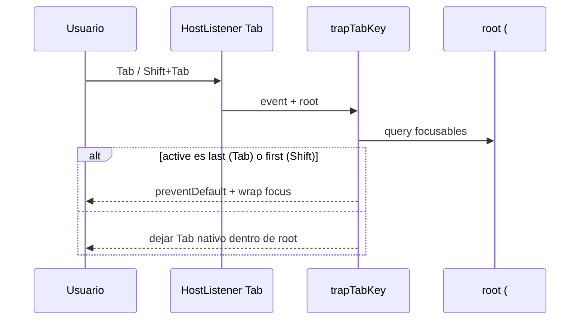

# Design: U4 — accesibilidad y responsive (quirúrgico)

## Technical Approach

Pass CSS/HTML/attrs, orden locked: login → CTAs públicos → drawer trap+`aria-modal` → diálogos (entrega/revocar/error) → spot listados. Reusa trap P6-05; cierra backdrop focusable fuera del contenedor. Sin API, rediseño ni archive U3. Specs lean vía `sdd-spec`.

## Architecture Decisions

| Decisión | Opciones | Tradeoff | Elección |
|---------|----------|----------|----------|
| Backdrop fuera del trap | (A) Incluir en query (B) Sacar del tab order | A mantiene Enter-backdrop; B menos lógica | **B** — delivery: quitar `tabindex="0"`; revoke: `div`/`button` no tabulable + click/Esc/X |
| Helper compartido | Copy-paste ×3 vs `trapTabKey` | ~20 líneas vs duplicación | **Helper** `shared/util/trap-tab.ts` — delivery, revoke, drawer |
| Contenedor del trap | Solo `#dialog` vs capa overlay+panel | Drawer = overlay button + aside | Diálogos: `#dialog`. Drawer: wrapper overlay+aside (preferido) |
| Retorno de foco | SPA opener vs soft ruta/`menu-btn` | SPA complejo; Esc ya navega | **Soft** — drawer→`.menu-btn`; diálogos Esc→expediente |
| Error-dialog entrega | Ignorar vs `#dialog`+trap+foco | Falta foco inicial | **Incluir** `#dialog`, `tabindex="-1"`, foco + helper |
| Contraste / `.sr-only` | Ahora vs DEFER | Tokens ≈ rediseño | **DEFER** salvo bug claro en smoke |

## Data Flow

```
Abrir overlay (drawer | diálogo)
  → foco inicial (close / #dialog)
  → keydown Tab/Shift+Tab → trapTabKey(e, root)
       ├─ first/last dentro de root → preventDefault + wrap
       └─ backdrop NO en tab order
  → Esc / overlay click / X → cerrar
       ├─ drawer: menuAbierto=false + foco .menu-btn
       └─ diálogo: router → expediente (foco soft por ruta)
```



## File Changes

| File | Action | Description |
|------|--------|-------------|
| `apps/frontend-angular/src/app/shared/util/trap-tab.ts` | Create | `FOCUSABLE_SEL` + `trapTabKey(e, root)`; opcional `listFocusables(root)` |
| `…/shared/util/trap-tab.spec.ts` | Create | Unit: wrap first↔last; ignore si root vacío |
| `…/admin/admin-shell.ts` | Modify | `onTab` con helper; root = capa drawer+overlay |
| `…/admin/admin-shell.html` | Modify | `aria-modal="true"` en drawer; wrapper opcional de capa |
| `…/admin/admin-shell.spec.ts` | Modify | Tab no escapa con menú abierto; `aria-modal` |
| `…/delivery/certification-delivery-page.html` | Modify | Backdrop sin tab; error `#dialog`+attrs |
| `…/delivery/certification-delivery-page.ts` | Modify | Usar helper; foco error-dialog |
| `…/delivery/certification-delivery-page.spec.ts` | Modify | Tab no enfoca backdrop; error usable |
| `…/revoke/certification-revoke-page.html` | Modify | Backdrop no tabulable |
| `…/revoke/certification-revoke-page.ts` | Modify | Usar helper |
| `…/revoke/certification-revoke-page.spec.ts` | Modify | Tab no alcanza backdrop |
| `…/public-validation/public-validation-page.css` | Modify | Solo si smoke: 1–3 líneas `:focus-visible` en CTAs |
| `…/login-*` | Modify | Solo si smoke falla |
| Listados CSS (spot) | Modify | Solo rotura mobile evidente (`overflow-x`/stack) |
| `openspec/changes/.../specs/*` | Create | Vía `sdd-spec` (no aquí) |

**No tocar:** archive U3, API/PHP, `styles.css` tokens/`.sr-only` (DEFER), `confirm()` nativo, breakpoints globales.

## Interfaces / Contracts

```ts
/** Selector canónico alineado al trap P6-05 actual. */
export const FOCUSABLE_SEL =
  'a[href], button:not(:disabled), textarea, input, select, [tabindex]:not([tabindex="-1"])';

export function trapTabKey(e: KeyboardEvent, root: HTMLElement): void;
```

Markup: drawer abierto → `aria-modal="true"`; backdrops → no focusables en tab order; click/Esc/X sin cambio de negocio.

## Testing Strategy

| Layer | What | Approach |
|-------|------|----------|
| Unit | `trapTabKey` wrap | Spec puro DOM mínimo |
| Component | Shell drawer Tab + `aria-modal`; delivery/revoke backdrop fuera de tab; error entrega focuseable | Extender specs existentes (fakeAsync/dispatch Tab) |
| Smoke manual | Login teclado; CTAs públicos anillo; listado angosto sin rotura | Checklist U4; contraste solo si falla a ojo |

## Threat Matrix

N/A — sin cambios de routing privilegiado, shell/subprocess, VCS/PR automation ni clasificación de ejecutables. Esc/nav a expediente se preserva.

## Migration / Rollout

Sin migración. Diff FE + deltas de spec. Presupuesto ~400 líneas: si crece, encadenar slice shell/públicos vs diálogos. Rollback = revert commits FE.

## Open Questions

- [x] Contraste / `.sr-only` → DEFER (locked)
- [x] Retorno foco → soft (locked)
- [x] Error-dialog → MUST mínimo en U4 (locked)
- [ ] Smoke login/CTAs: ¿refuerzo CSS necesario? (decidir en apply tras smoke)
- [ ] ¿Wrapper HTML drawer vs multi-root en helper? Preferir wrapper si no rompe CSS drawer
